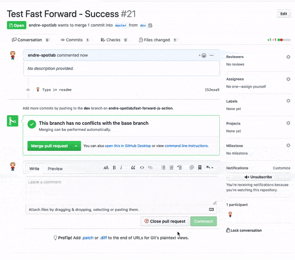

# Fast Forward PR Action

Merge pull request (PR) using fast forward only, if possible, moving base branch (target branch) to head branch (source branch). Comment success or failure messages on the pull request issue. The goal is to keep branches equal at the end of the merge.

```git checkout target_base && git merge source_head --ff-only```

As a more advanced use case, this action can also update status API (with success or failure), which can be used to block pr when status checks are required to pass before merging. You can also have different failure messages commented on the pr issue, based on the state of a staging and a production branch.

## Example Usage



- Comment ```/fast-forward``` in a pull request.
- Wait for the action to execute (~10 seconds)

To set-up this GitHub action in your repository, check out the example workflow description file in .github/workflows/. You can see one set up for the basic use case, and one for the advanced use case.

## Inputs

- `GITHUB_TOKEN`:
  - Automatically provided token, that can be used to authenticate on behalf of the GitHub action, with permissions limited to the repository that contains your workflow
- `success_message`:
  - Generic success message, will be commented on the pull request, if pull-request fast forward succeeds
- `failure_message`:
  - Generic failure message, Will be commented on the pull request, if pull-request fast forward fails
- `update_status`:
  - Optional, if true, the status API is used to set failure or success as a state for the commit, which can be used to gate merging. Default value is false.
- `failure_message_same_stage_and_prod`:
  - Optional, failure message, when pull-request fast forward fails, and staging branch equals production branch.
- `failure_message_diff_stage_and_prod`:
  - Optional, failure message, when pull-request fast forward fails, and staging branch and production branch are at different commits
- `production_branch`:
  - Optional, production branch name. Default value is master.
- `staging_branch`:
  - Optional, staging or preproduction branch name. Default value is staging.

## Development

### Prerequisites

```shell
npm install
npm install --global npm-check-updates
ncu; npx npm-check-updates
ncu -u; ncu --upgrade
```

### Compile (TypeScript to JavaScript)

```shell
tsc --build tsconfig.json --verbose
```

Recompile as if all files are out of date.

```shell
tsc --build tsconfig.json --force --verbose
```

We can also watch input files.

```shell
tsc --build tsconfig.json --force --verbose --watch
```

Commit changes with a pull request.
